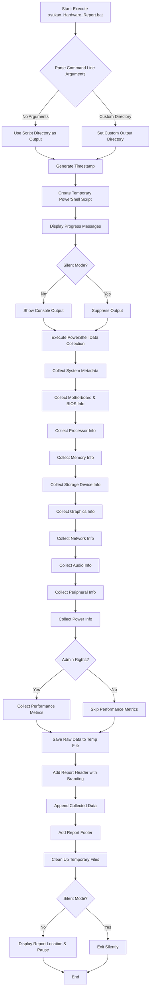
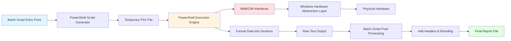

# xsukax Windows System Hardware Report


A comprehensive, lightweight hardware diagnostic and inventory tool for Windows systems that generates detailed reports of your system's hardware configuration without requiring third-party software or external dependencies.

## Project Overview

**xsukax Windows System Hardware Report** is a powerful batch script utility designed to provide IT professionals, system administrators, and power users with complete visibility into their Windows hardware configuration. The tool leverages native Windows Management Instrumentation (WMI) and PowerShell capabilities to extract detailed information about system components, creating human-readable reports that can be used for inventory management, troubleshooting, pre-sale documentation, warranty claims, or system audits.

Unlike commercial hardware inventory tools, this solution:
- Runs entirely offline without internet connectivity requirements
- Uses only native Windows components (no additional software installation needed)
- Generates portable text-based reports that can be easily shared, archived, or processed
- Works across all modern Windows versions (Windows 7, 8, 8.1, 10, and 11)
- Provides transparency through open-source code that can be audited and customized

The generated reports include comprehensive details about:
- **System metadata** (computer name, user, uptime, Windows version)
- **Motherboard and BIOS** information
- **Processor** specifications (cores, cache, clock speeds)
- **Memory** configuration (capacity, speed, manufacturer)
- **Storage devices** (HDDs, SSDs, partitions)
- **Graphics adapters** and display configuration
- **Network interfaces** and adapters
- **Audio devices** and controllers
- **Peripheral devices** (monitors, keyboards, mice)
- **Power information** (battery status and health for laptops)
- **Performance metrics** (when run with administrator privileges)
- **Security updates** and installed hotfixes

## Security and Privacy Benefits

### Complete Local Execution
All data collection and processing occurs entirely on the local machine without any network communications. The script does not:
- Connect to external servers or cloud services
- Transmit data over the internet
- Store credentials or sensitive authentication information
- Install background services or persistent processes

### Data Sovereignty
Users maintain complete control over generated reports:
- Reports are saved locally to a user-specified directory
- No automatic upload or sharing mechanisms exist
- Serial numbers and identifiers are displayed only for legitimate inventory purposes
- Users can review, redact, or delete sensitive information before sharing reports

### Transparency Through Open Source
The entire codebase is available for inspection, allowing security-conscious users to:
- Audit the script for malicious code or unwanted behavior
- Verify that no data exfiltration occurs
- Understand exactly what information is collected and how
- Modify the script to exclude specific data points if desired

### Minimal Permission Requirements
While the script can run with standard user privileges, administrator rights are only required for:
- Performance metrics collection
- Certain advanced hardware details
- The script clearly indicates which features require elevation

### No Third-Party Dependencies
By relying exclusively on built-in Windows components (batch scripting, PowerShell, and WMI), the tool:
- Eliminates risks associated with untrusted third-party libraries
- Prevents supply chain attacks through compromised packages
- Reduces attack surface by not introducing additional executables
- Ensures compatibility and stability across Windows versions

### Safe Error Handling
The script implements robust error handling:
- Failed data collection attempts do not crash the script
- Errors are silently logged rather than exposing system internals
- Temporary files are automatically cleaned up after execution
- No persistent changes are made to the system registry or configuration

## Features and Advantages

### Comprehensive Hardware Inventory
- **25+ hardware categories** scanned and documented
- **Detailed component specifications** including model numbers, manufacturers, and technical specifications
- **Memory slot-by-slot analysis** showing installed DIMMs and available expansion capacity
- **Drive health indicators** including SMART status and partition layouts
- **Battery health reporting** for laptops with wear level calculations

### Zero Installation Required
- Single batch file execution - no installation wizard, no registry modifications
- Portable design allows running from USB drives or network shares
- No administrative setup required for basic functionality
- Clean execution with automatic temporary file cleanup

### Flexible Output Options
- Timestamped reports prevent accidental overwrites
- Custom output directory support via command-line parameter
- Silent mode for automation and scripting integration
- Human-readable text format compatible with all text editors and search tools

### Cross-Version Compatibility
- Tested on Windows 7, 8, 8.1, 10, and 11
- Gracefully handles missing features on older Windows versions
- Requires only PowerShell 2.0+ (included in Windows 7 and later)
- Architecture-agnostic (works on x86 and x64 systems)

### Performance Optimized
- Typical execution time: 15-30 seconds
- Minimal system resource usage during execution
- Efficient WMI queries prevent system slowdown
- No background processes or services left running

### Professional Report Format
- Structured sections with clear headers and separators
- Branded output with creator attribution
- Tabular data presentation for easy reading
- Complete metadata including generation timestamp and context

### Enterprise-Ready Features
- Silent mode for scheduled task automation
- Scriptable integration with batch workflows
- Suitable for compliance documentation and IT asset management
- Generates reports that can be parsed by configuration management tools

## Installation Instructions

### Prerequisites
- Windows 7 or later (Windows 7, 8, 8.1, 10, or 11)
- PowerShell 2.0 or later (included by default in Windows 7+)
- No additional software or dependencies required

### Installation Steps

#### Method 1: Direct Download
1. Visit the GitHub repository: [https://github.com/xsukax/xsukax-Windows-System-Hardware-Report](https://github.com/xsukax/xsukax-Windows-System-Hardware-Report)
2. Click the green **Code** button and select **Download ZIP**
3. Extract the downloaded ZIP file to your desired location
4. Navigate to the extracted folder and locate `xsukax_Hardware_Report.bat`

#### Method 2: Git Clone
```bash
git clone https://github.com/xsukax/xsukax-Windows-System-Hardware-Report.git
cd xsukax-Windows-System-Hardware-Report
```

#### Method 3: Direct File Download
1. Navigate to the repository: [https://github.com/xsukax/xsukax-Windows-System-Hardware-Report](https://github.com/xsukax/xsukax-Windows-System-Hardware-Report)
2. Click on `xsukax_Hardware_Report.bat`
3. Click the **Raw** button
4. Right-click on the page and select **Save as...**
5. Save the file with a `.bat` extension

### Verification
After downloading, verify the file:
- File name: `xsukax_Hardware_Report.bat`
- File type: Windows Batch File (.bat)
- File size: Approximately 25 KB

### Optional: Add to PATH
For convenient access from any directory:
1. Copy `xsukax_Hardware_Report.bat` to `C:\Windows\System32\` (requires administrator privileges)
2. Or add the script's directory to your system PATH environment variable

## Usage Guide

### Basic Usage

#### Standard Execution
Double-click `xsukax_Hardware_Report.bat` or run from Command Prompt:
```batch
xsukax_Hardware_Report.bat
```

This will:
1. Display a welcome message with progress information
2. Collect comprehensive hardware data (takes 15-30 seconds)
3. Generate a report in the same directory as the script
4. Display the report location and file size
5. Prompt to continue (press any key to close)

**Output:** `xsukax_Hardware_Report_YYYY-MM-DD_HHMM.txt` in the script's directory

#### With Administrator Privileges (Recommended)
Right-click `xsukax_Hardware_Report.bat` and select **Run as administrator**

This enables:
- Real-time performance metrics (CPU usage, available memory)
- Complete hardware details that require elevated permissions
- Access to advanced WMI namespaces

### Advanced Usage

#### Custom Output Directory
Specify where to save the report:
```batch
xsukax_Hardware_Report.bat "C:\Reports"
```

```batch
xsukax_Hardware_Report.bat "D:\IT_Audits\Hardware_Inventory"
```

**Note:** The output directory must exist before running the script.

#### Silent Mode
For automation, scripting, or scheduled tasks:
```batch
xsukax_Hardware_Report.bat "C:\Reports" /silent
```

Silent mode:
- Suppresses all console output
- Skips the pause at the end
- Ideal for Task Scheduler, batch files, or automation scripts
- Returns immediately after report generation

#### Combined Parameters Example
```batch
xsukax_Hardware_Report.bat "%USERPROFILE%\Documents\Hardware_Reports" /silent
```

### Command-Line Reference

```
Syntax: xsukax_Hardware_Report.bat [output_directory] [/silent]

Parameters:
  output_directory  Optional. Full path where the report will be saved.
                    Default: Script's current directory
                    
  /silent          Optional. Suppress console output and auto-close.
                    Use as the second parameter only.

Examples:
  xsukax_Hardware_Report.bat
  xsukax_Hardware_Report.bat "C:\Reports"
  xsukax_Hardware_Report.bat "D:\Inventory" /silent
```

### Viewing the Report

The generated report is a standard text file that can be opened with:
- **Notepad** (built-in): `notepad report_name.txt`
- **Notepad++** (recommended for large reports)
- **Visual Studio Code**
- **Any text editor or word processor**

Search functionality works natively (Ctrl+F in most editors) for quick information lookup.

### Automation Example

Create a scheduled task to generate weekly reports:

1. Create a batch file `weekly_report.bat`:
```batch
@echo off
set REPORT_DIR=C:\Hardware_Reports\Weekly
if not exist "%REPORT_DIR%" mkdir "%REPORT_DIR%"
call "C:\Tools\xsukax_Hardware_Report.bat" "%REPORT_DIR%" /silent
```

2. Use Task Scheduler to run `weekly_report.bat` weekly at your preferred time

### Process Workflow

The following Mermaid diagram illustrates the script's execution process:



### Data Collection Architecture



### Report Structure Overview

```mermaid
graph TB
    A[Hardware Report File] --> B[Header Section]
    A --> C[System Metadata]
    A --> D[Hardware Sections]
    A --> E[Footer Section]
    
    B --> B1[Title & Branding]
    B --> B2[Creator Information]
    B --> B3[License & Version]
    B --> B4[Generation Timestamp]
    
    C --> C1[Computer Name]
    C --> C2[User & Domain]
    C --> C3[Admin Status]
    C --> C4[Windows Version]
    C --> C5[Uptime & Last Boot]
    
    D --> D1[Motherboard & BIOS]
    D --> D2[Processor]
    D --> D3[Memory]
    D --> D4[Storage Devices]
    D --> D5[Graphics]
    D --> D6[Network]
    D --> D7[Audio]
    D --> D8[Peripherals]
    D --> D9[Power/Battery]
    D --> D10[Performance Metrics]
    
    E --> E1[End Marker]
    E --> E2[Creator Attribution]
    E --> E3[GitHub Link]
    
    style A fill:#f9f9f9
    style B fill:#e3f2fd
    style C fill:#fff3e0
    style D fill:#e8f5e9
    style E fill:#fce4ec
```



## Licensing Information

This project is licensed under the GNU General Public License v3.0.

## Troubleshooting

### Common Issues and Solutions

**Issue:** Script won't run / "Access Denied" error
- **Solution:** Right-click the script and select "Run as administrator"

**Issue:** "Execution Policy" error in PowerShell
- **Solution:** The script automatically uses `-ExecutionPolicy Bypass`. If issues persist, run in Command Prompt, not PowerShell directly.

**Issue:** Report is incomplete or missing sections
- **Solution:** Run with administrator privileges for complete hardware access

**Issue:** "WMIC is deprecated" warning on Windows 11
- **Solution:** The script uses CIM (Common Information Model) cmdlets which are the modern replacement. Warnings can be safely ignored.

**Issue:** Report location unknown
- **Solution:** By default, reports save to the same directory as the script with a timestamp in the filename

**Issue:** Script takes too long
- **Solution:** 15-30 seconds is normal. If it takes longer than 2 minutes, check for system issues or antivirus interference.

## Contributing

Contributions, bug reports, and feature requests are welcome! Please visit the [GitHub repository](https://github.com/xsukax/xsukax-Windows-System-Hardware-Report) to:
- Report issues
- Submit pull requests
- Suggest enhancements
- Share use cases

## Support

For questions, issues, or support:
- **GitHub Issues:** [https://github.com/xsukax/xsukax-Windows-System-Hardware-Report/issues](https://github.com/xsukax/xsukax-Windows-System-Hardware-Report/issues)
- **Website:** [https://xsukax.com](https://xsukax.com)

## Credits

**Created by:** xsukax  
**GitHub:** [https://github.com/xsukax](https://github.com/xsukax)  
**Version:** 1.0  
**License:** GPL v3.0

---

**Note:** This tool is designed for legitimate system administration, inventory management, and diagnostic purposes. Users are responsible for ensuring compliance with their organization's IT policies and applicable privacy regulations when collecting and storing hardware information.
